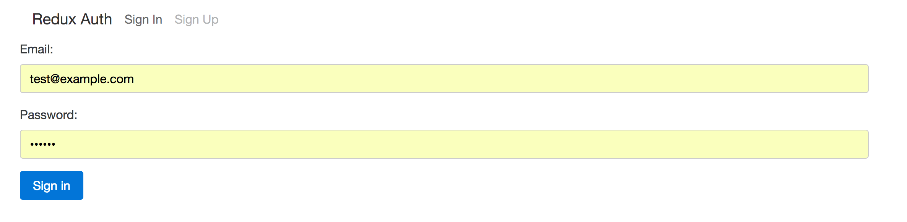

# React Auth: Client Server Boilerplate

- Built a client server authorization boilerplate.

- Used React and Redux to create components and manage state of user

- Used Redux-Form for client side validation

## To Start:

- git clone or download zip for auth-client & auth-server

- In client: - npm run start

- In cerver: - mongod
			 - npm run dev